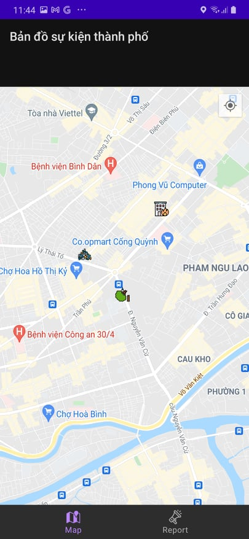

# AIOT

This is the repo for the mobile app. Repo for server can be found at https://github.com/khoa3101/backend

Our app allows people to report incidents in the city by simply uploading an image. Types of detectable incidents include fallen trees, fire, flooding, poor road conditions, traffic jams, trash, and traffic accidents. 

If the uploaded image depicts any of the above incidents, it will be represented with the corresponding icon at the upload location in the map.

To classify images, we use a ViT (Vision Transformer) model on the server. The ViT model splits each image into several regions that are neither too small nor too large to represent the features and properties of each region of the image. Then, the model will extract the most meaningful features in each region and pay attention to the correlation between regions before making the final conclusion.
